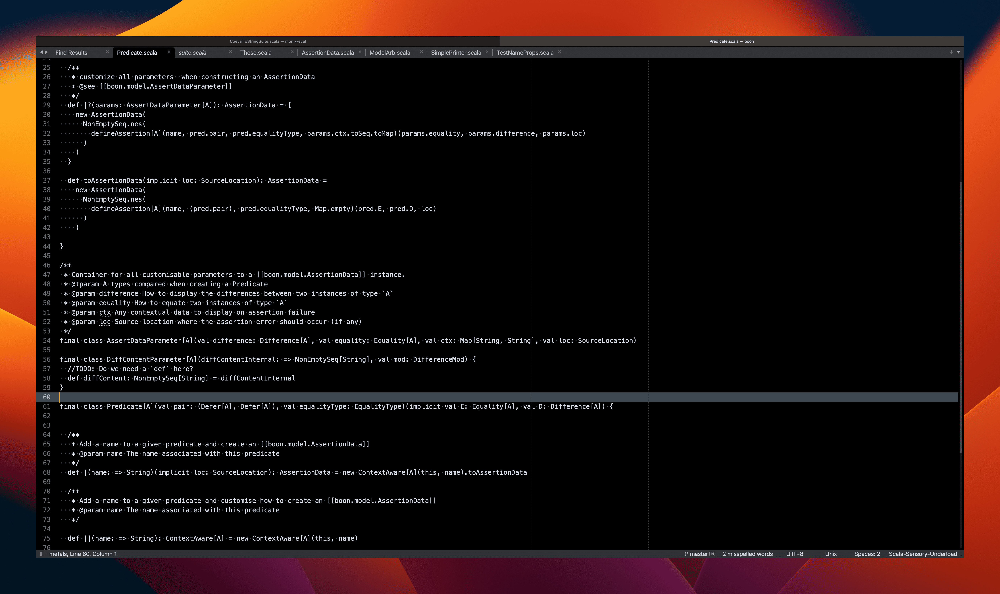
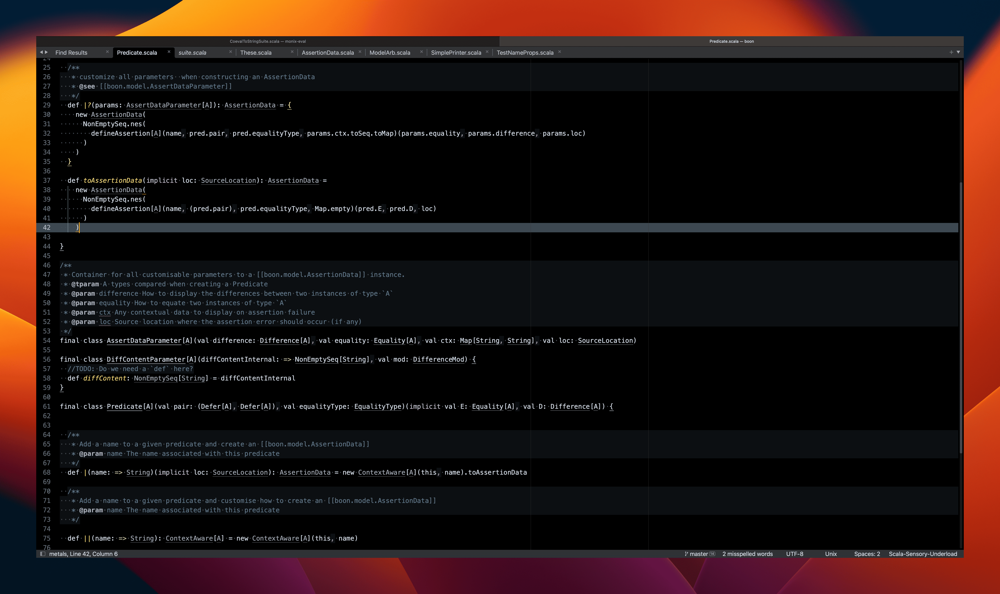
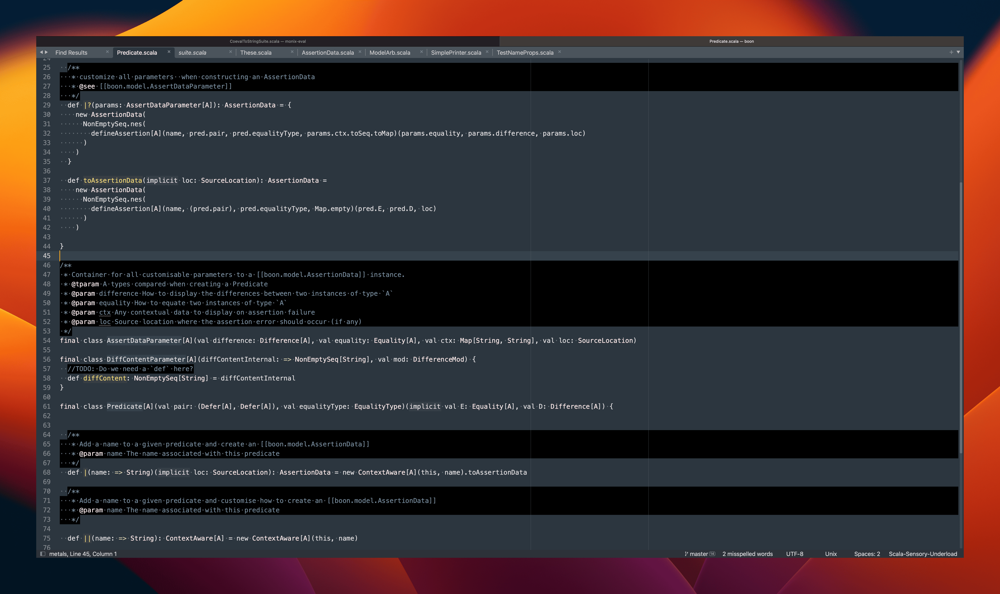
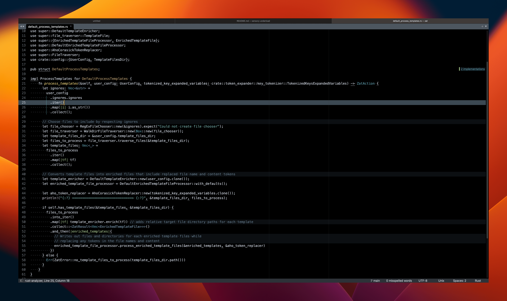

# Sensory Underload

A different take on syntax highlighting for Sublime Text.

## Installation

### Through Package Control

_Thanks to [Justin Lam](https://github.com/ninth-dev) for this solution_.

1. cmd + shift + p
1. type in : pcar ( Package Control: Add Repository )
1. paste in : https://github.com/ssanj/sensory-underload
1. cmd + shift + p
1. type in: pcip ( Package Control: Install Package )
1. type in: sensory-underloaded

### Clone and Modify Locally

1. Clone this repo
1. Symlink checkout under your Sublime Text Packages directory

    You can find your packages directory by going to `Preferences` > `Browse Packages`.

    On Macos it should be `~/Library/Application Support/Sublime Text/Packages`


## Usage

You should now see the following UI colour schemes under `UI: Select Color Scheme` in the command palette:

### Generic colour schemes

1. Free Your Mind (No syntax highlighting)



### Scala-specific colour schemes

1. Scala to the Min (Minimal highlighting)


1. Scala to the Mid (Slightly more highlighting)



1. Scala Light



Consider installing the `scala-sensory-underload.sublime-syntax` for your scala files for a more customised experience.

If you want to set one of the above colour schemes as the default for `scala` or `scala-sensory-underload` you can do
so by running the `Preferences: Settings - Syntax Specific` command while within a `scala` or `scala-sensory-underload`
file.

For example, the syntax-specific settings for using the `Scala to the Min.sublime-color-scheme` for scala files are:

```
{
    "color_scheme": "Scala to the Min.sublime-color-scheme",
    "font_size": 18
}
```

See [Colour Themes](docs/colour-schemes.md) for more information.

### Rust colour schemes

1. Rust to the Min


