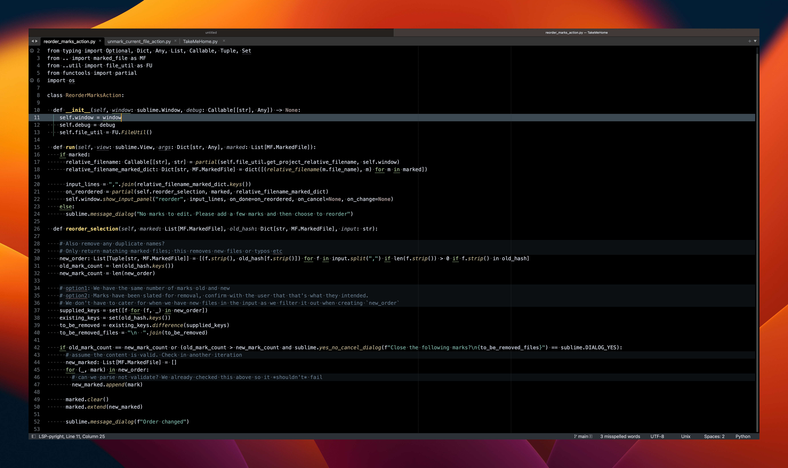
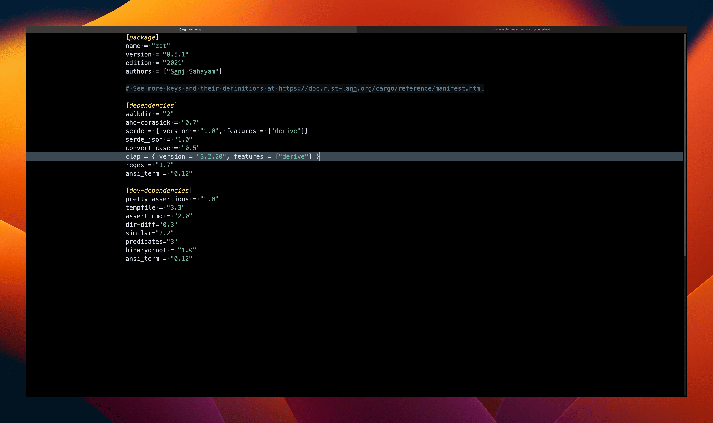
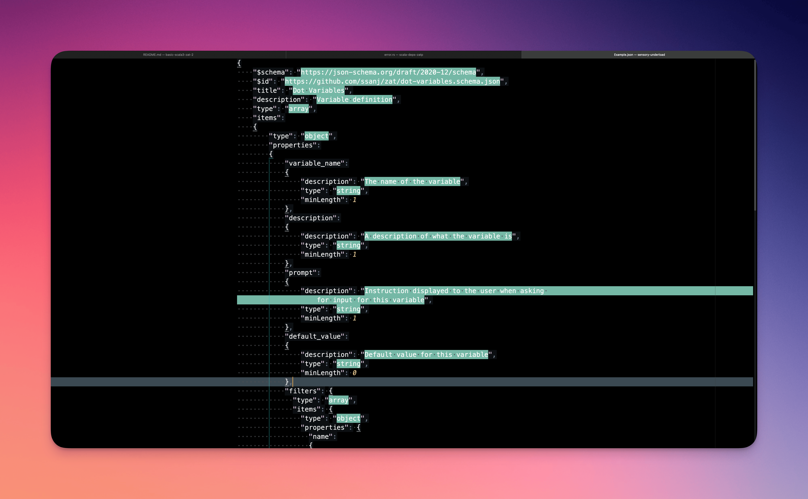

# Sensory Underload

A different take on syntax highlighting for Sublime Text.

## Installation

### Through Package Control

_Thanks to [Justin Lam](https://github.com/ninth-dev) for this solution_.

- Open the command palette with `CMD + SHIFT + P`
- Select `Package Control: Add Repository`
- Enter https://github.com/ssanj/sensory-underload for the repository
- Open the command palette again with `CMD + SHIFT + P`
- Select `Package Control: Install Package`
- Choose `sensory-underload`

### Clone and Modify Locally

1. Clone this repo
1. Symlink checkout under your Sublime Text Packages directory

    You can find your packages directory by going to `Preferences` > `Browse Packages`.

    On Macos it should be `~/Library/Application Support/Sublime Text/Packages`


## Usage

You should now see the following UI colour schemes under `UI: Select Color Scheme` in the command palette:

### Generic colour schemes

1. Free Your Mind (No syntax highlighting)


### Scala-specific colour schemes

2. Scala to the Min (Minimal highlighting)


3. Scala to the Mid (Slightly more highlighting)


4. Scala Light


Consider installing the `scala-sensory-underload.sublime-syntax` for your scala files for a more customised experience.

If you want to set one of the above colour schemes as the default for `scala` or `scala-sensory-underload` you can do
so by running the `Preferences: Settings - Syntax Specific` command while within a `scala` or `scala-sensory-underload`
file.

For example, the syntax-specific settings for using the `Scala to the Min.sublime-color-scheme` for scala files are:

```
{
    "color_scheme": "Scala to the Min.sublime-color-scheme",
    "font_size": 18
}
```

See [Colour Themes](docs/colour-schemes.md) for more information.

### Rust to the Min


### Python to the Min



### Toml to the Min



## Markdown to the Min


## JSON to the Min


