# Scala to the Min

A minimal set of highlights when working with the Scala language.

## Comments

Syntax highlighting for various comment types.

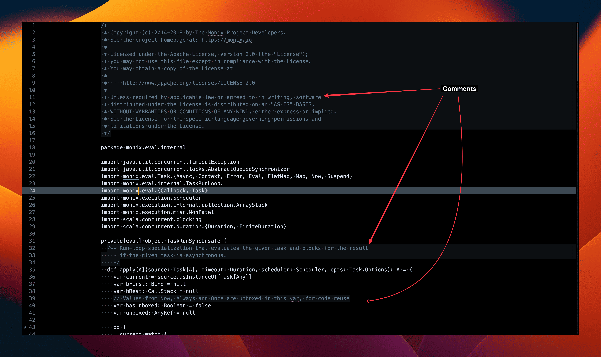

### Scaladoc comment block

Comments that start with `/**`


<details>
  <summary>Config</summary>

```
{
    "name": "Comment",
    "scope": "source.scala comment, source.scala punctuation.definition.comment",
    "foreground": "hsla(210, 15%, 47%, 1)",
    "background": "hsla(210, 15%, 6%, 1)",
}
```
</details>

### Inline comment

Comments that start with `//`.

<details>
  <summary>Config</summary>

```
{
    "name": "Inline comment",
    "scope": "source.scala comment.line.double-slash",
    "foreground": "hsla(210, 15%, 47%, 1)",
    "background": "hsla(210, 15%, 6%, 1)",
}
```
</details>

## Scaladoc Params

Syntax highlighting for Scaladoc parameters and parameter types.

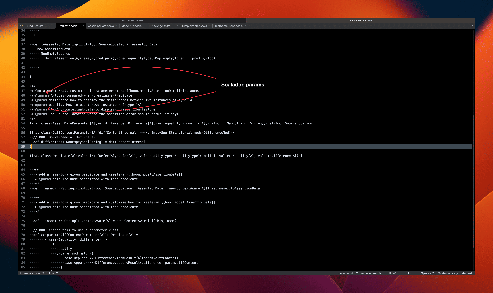


<details>
  <summary>Config</summary>

```
{
    "name": "Scaladoc Keyword",
    "scope": "source.scala keyword.other.documentation",
    "foreground": "var(blue6)",
    "font_style": "bold",
}
```
</details>


## Strings

Syntax highlighting for regular and embedded strings.

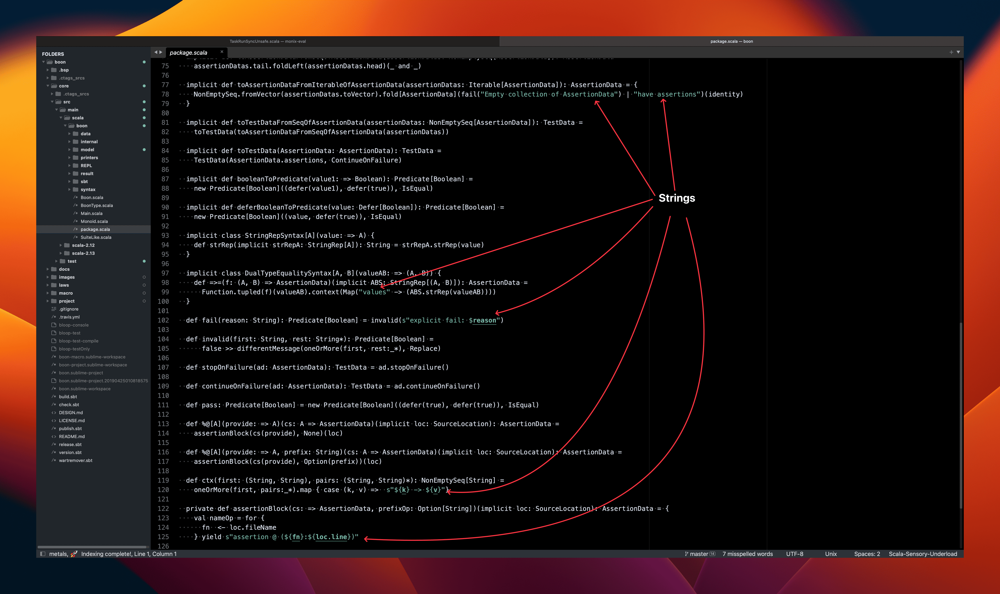

### Basic String

<details>
  <summary>Config for Strings and interpolated variables</summary>

```
{
    "name": "String",
    "scope": "source.scala string.quoted, source.scala punctuation.definition.variable",
    "foreground": "hsla(162, 49%, 76%, 0.81)",
}
```
</details>

### String interpolation

<details>
  <summary>Config for interpolated blocks</summary>

```
{
    "name": "Embedded String",
    "scope": "source.scala source.scala.embedded",
    "foreground": "hsla(162, 49%, 76%, 0.81)",
    "font_style": "bold underline",
},
```

 </details>

 ## Arrows

 Syntax highlighting for arrows in higher order function definitions and case matches.

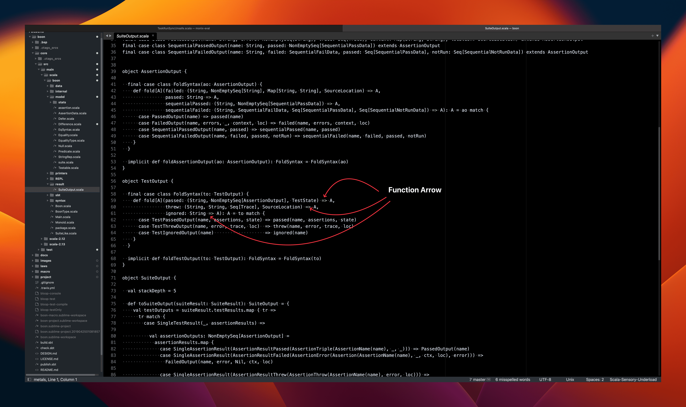

 <details>
  <summary>Config</summary>

```
// Fat arrow
{
    "name": "Fat arrow",
    "scope": "source.scala keyword.declaration.function.arrow",
    "foreground": "var(green2)",
},

// Function arrow
{
    "name": "Function arrow",
    "scope": "source.scala keyword.operator.arrow - source.scala meta.import.scala",
    "foreground": "var(green2)",
},
```
</details>

## Braces

Syntax highlighting for braces used in class blocks and function blocks.


### Class blocks

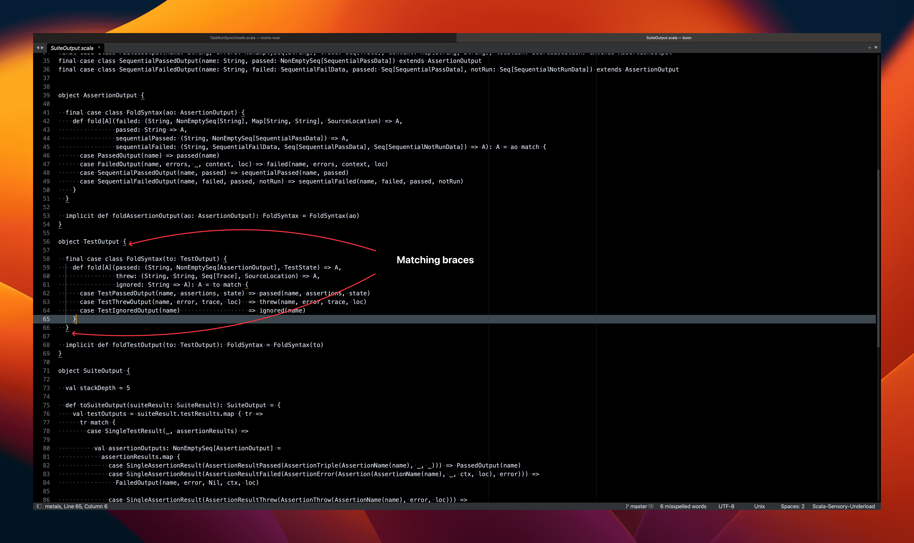


 <details>
  <summary>Config</summary>

```
{
    "name": "Class braces",
    "scope": "source.scala meta.class.body punctuation.section.braces",
    "font_style": "underline",
}
```
</details>

### Function blocks

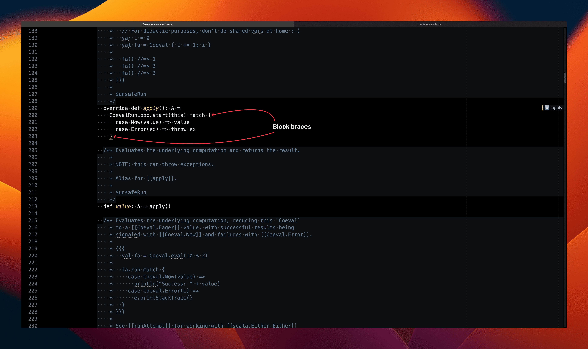

 <details>
  <summary>Config</summary>

```
{
    "name": "Block braces",
    "scope": "source.scala punctuation.section.block",
    "foreground": "var(yellow_light)",
    "font_style": "underline",
}
```
</details>


## Names

Syntax highlighting for the names of various things.

### Function Names

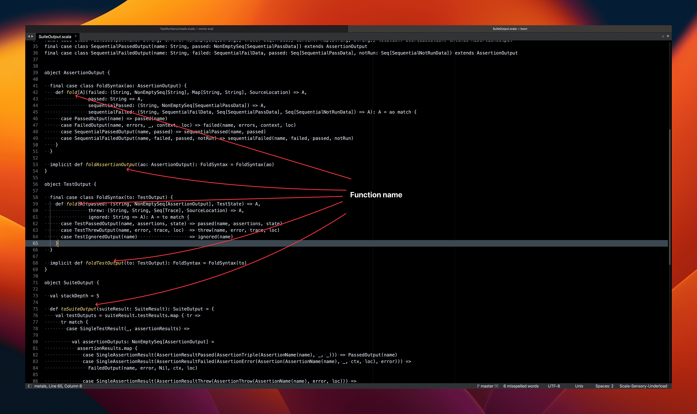

 <details>
  <summary>Config</summary>

```
{
    "name": "Function name",
    "scope": "source.scala entity.name.function",
    "foreground": "var(yellow)",
    "font_style": "italic",
}
```
</details>

### Vals

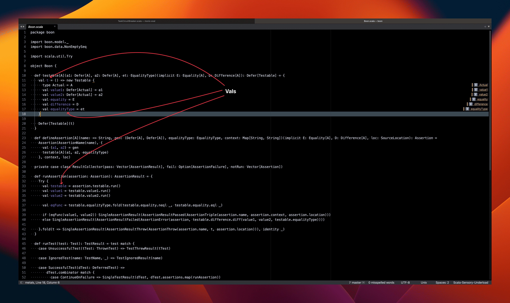

 <details>
  <summary>Config</summary>

```
{
    "name": "Vals",
    "scope": "source.scala meta.class.body variable.other.constant, source.scala meta.block variable.other.constant",
    "foreground": "hsla(242, 82%, 77%, 0.78)",
}
```
</details>

### Vars

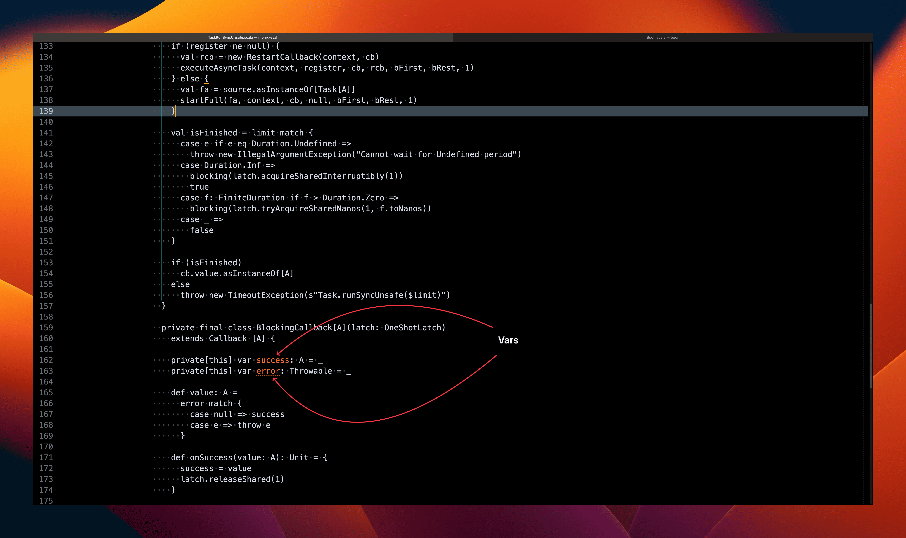

 <details>
  <summary>Config</summary>

```
{
    "name": "Vars",
    "scope": "source.scala meta.class.body variable.other.readwrite",
    "foreground": "var(red2)",
    "font_style": "stippled_underline",
}
```
</details>

## Class Names


 <details>
  <summary>Config</summary>

```
{
    "name": "Class name",
    "scope": "source.scala entity.name.class",
    "font_style": "underline",
}
```
</details>

## Base type Names

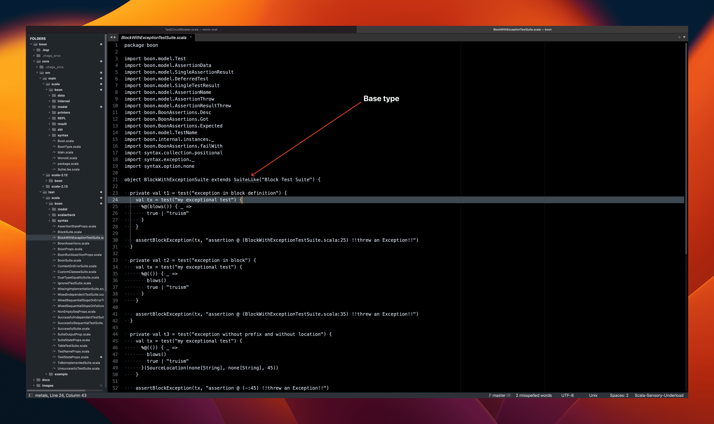

 <details>
  <summary>Config</summary>

```
{
    "name": "Inherited class",
    "scope": "source.scala entity.other.inherited-class.scala",
    "foreground": "var(blue6)",
    "font_style": "bold stippled_underline",
}
```
</details>

## Types

### Type aliases

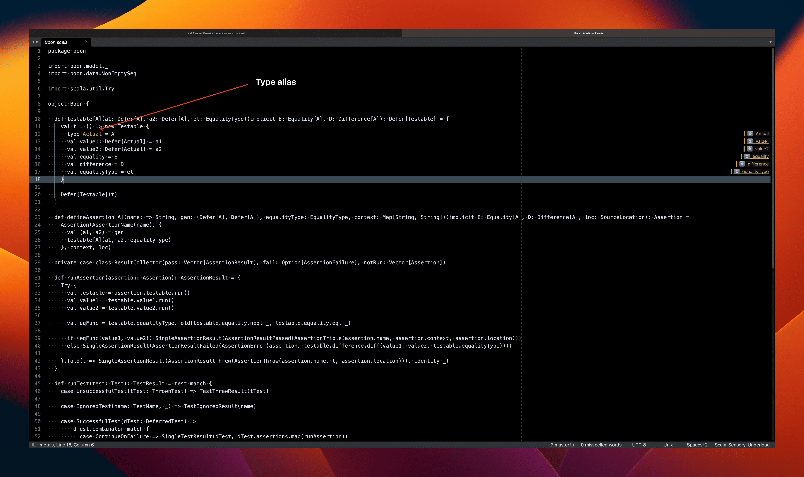

 <details>
  <summary>Config</summary>

```
{
    "name": "Type alias",
    "scope": "source.scala entity.name.type",
    "foreground": "hsla(39, 82%, 77%, 0.78)",
}
```
</details>

### Undesirable types

Syntax highlighting the following types that lead to errors:
- Unit
- Any
- AnyRef
- Nothing

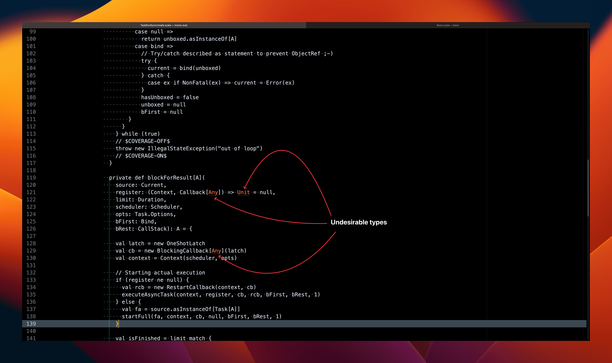

 <details>
  <summary>Config</summary>

```
{
    "name": "Undesirable types (Unit, Any, AnyRef, Nothing)",
    "scope": "storage.type.primitive.Undesirable.scala",
    "foreground": "var(red2)",
     "font_style": "stippled_underline",
}
```
</details>

## Implicits


 <details>
  <summary>Config</summary>

```
{
    "name": "Implicits",
    "scope": "source.scala storage.modifier.implicit.scala",
    "foreground": "var(pink)",
}
```
</details>

## Separators

### Function and type separators


 <details>
  <summary>Config</summary>

```
{
    "name": "Sep",
    "scope": "source.scala punctuation.separator.scala - meta.import.selector",
    "foreground": "var(pink_lighter)",
    "background": "hsla(210, 15%, 6%, 1)",
}
```
</details>


### Statement termination with semicolons

Using semicolons to batch multiple statements is a bad practice and will be highlighted as such.

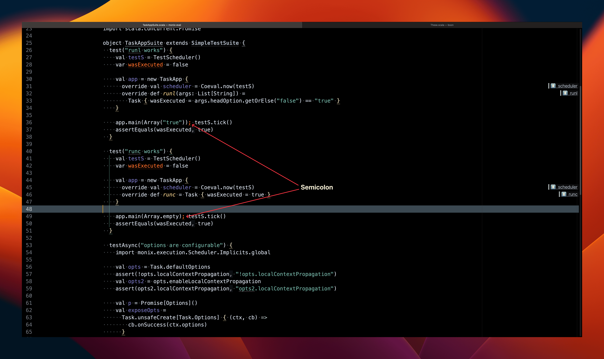

 <details>
  <summary>Config</summary>

```
{
    "name": "Punctuation",
    "scope": "source.scala punctuation.terminator",
    "foreground": "var(red2)",
    "font_style": "stippled_underline",
}
```
</details>


## Case blocks

Note the case blocks use the arrow highlights from [Arrows](#arrows)

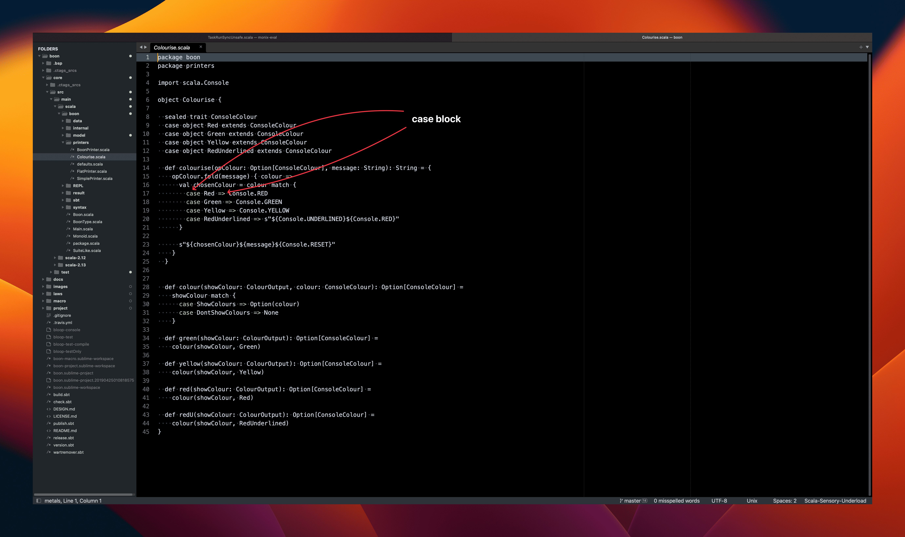

 <details>
  <summary>Config</summary>

```
{
    "name": "Keyword Case statement",
    "scope": "source.scala meta.block.scala keyword.declaration.other.scala",
    "foreground": "var(green2)",
},
```
</details>

## For-comprehension sequencing

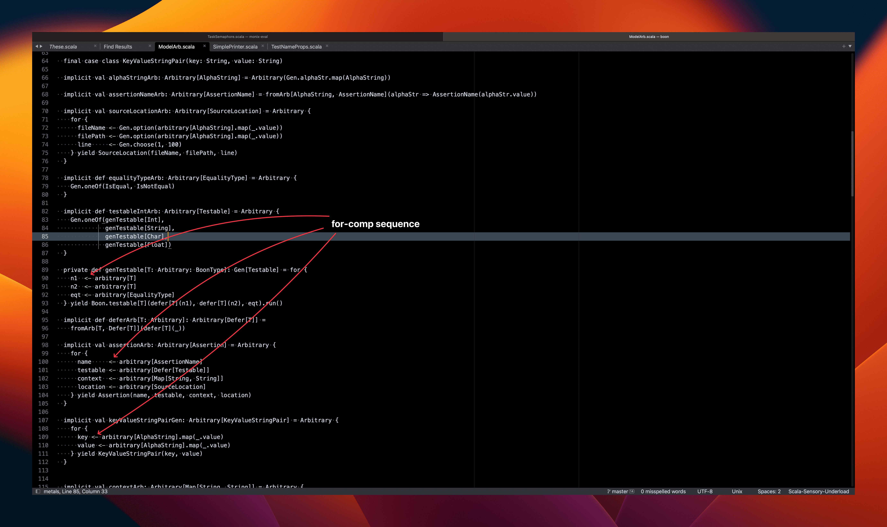

 <details>
  <summary>Config</summary>

```
{
    "name": "for-comp left arrow",
    "scope": "source.scala keyword.operator.assignment.scala keyword.operator.assignment.forleftarrow.scala",
    "foreground": "var(green2)",
}
```
</details>
